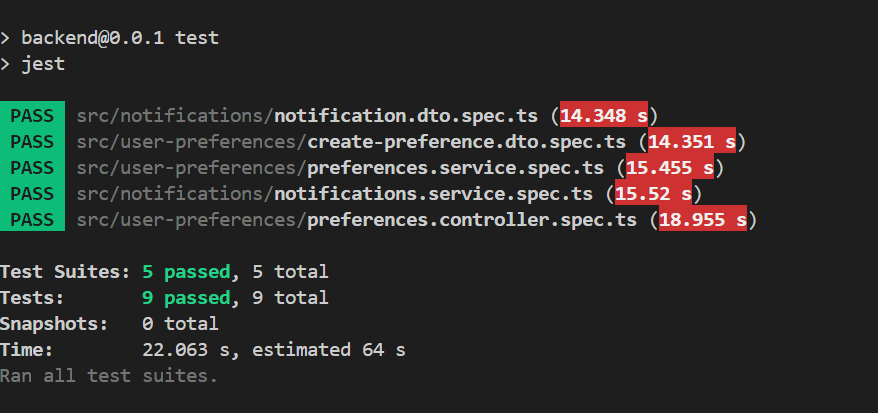

# **Zigment Assessment Backend**

This is a **Nest.js-based backend project** for managing user preferences and sending notifications. The project is deployed on **Vercel** and supports various APIs for CRUD operations and notifications with robust validation and logging mechanisms.

---

## **Features**

- **User Preferences Management**:
  - CRUD operations for managing user preferences.
- **Notification System**:
  - API for simulating and logging notifications.
  - Supports notification types like marketing, newsletters, and updates.
- **Error Handling**:
  - Centralized exception handling with a custom `HttpExceptionFilter`.
- **Validation**:
  - Request validation using `class-validator`.
- **Rate Limiting**:
  - Ensures APIs are rate-limited to prevent abuse.
- **Statistics Tracking**:
  - APIs for tracking notification statistics.
- **Deployment**:
  - Hosted on **Vercel** with serverless architecture.

---

## **Table of Contents**

- [Installation](#installation)
- [Environment Variables](#environment-variables)
- [API Endpoints](#api-endpoints)
- [Technologies Used](#technologies-used)
- [Development](#development)
- [Deployment](#deployment)
- [Contributing](#contributing)
- [License](#license)

---

## **Installation**

### **Clone the Repository**
```bash
git clone https://github.com/balasai45/zigment_assessment.git
cd zigment-assessment
```

### **Install Dependencies**
```bash
npm install
```

### **Build the Project**
```bash
npm run build
```

### **Run the Application**
```bash
npm start
```


The application will be available at `http://localhost:3000`.

---

## **Environment Variables**

Create a `.env` file in the root of the project and configure the following variables:

```plaintext
DATABASE_URL=mongodb+srv://<username>:<password>@cluster.mongodb.net/<database>
PORT=3000
```
or 

change the existing `.env` file with your 
---

## **API Endpoints**

### **Base URL**
- **Production**: `https://zigment-assessment-gkso83ut8-balas-projects-4107b07a.vercel.app/`
- **Local**: `http://localhost:3000`

### **Endpoints**

#### **User Preferences**
- **Create Preference**:
  - `POST /api/preferences`
  - Body:
    ```json
    {
      "userId": "user123",
      "email": "user@example.com",
      "preferences": {
        "marketing": true,
        "newsletter": false,
        "updates": true,
        "frequency": "weekly",
        "channels": { "email": true, "sms": false, "push": true }
      },
      "timezone": "America/New_York"
    }
    ```

- **Get Preference**:
  - `GET /api/preferences/:userId`

- **Update Preference**:
  - `PATCH /api/preferences/:userId`
  - Body: Partial updates allowed.

- **Delete Preference**:
  - `DELETE /api/preferences/:userId`

#### **Notifications**
- **Send Notification**:
  - `POST /api/notifications/send`
  - Body:
    ```json
    {
      "userId": "user123",
      "type": "marketing",
      "channel": "email",
      "content": {
        "subject": "Special Offer",
        "body": "Check out our latest deals!"
      }
    }
    ```

- **Get Notification Logs**:
  - `GET /api/notifications/:userId/logs`

- **Get Notification Stats**:
  - `GET /api/notifications/stats`

---

## **Technologies Used**

- **Backend**: [Nest.js](https://nestjs.com/)
- **Database**: [MongoDB](https://www.mongodb.com/)
- **Deployment**: [Vercel](https://vercel.com/)
- **Validation**: [class-validator](https://github.com/typestack/class-validator)
- **Testing**: [Jest](https://jestjs.io/) and [Supertest](https://github.com/visionmedia/supertest)

---

## **Development**

### **Run Locally**
```bash
npm start
```

### **Run Tests**
- **Unit Tests**:
  ```bash
  npm run test
  ```
- **End-to-End Tests**:
  ```bash
  npm run test:e2e
  ```

---

## **Deployment**

### **Deploy to Vercel**
1. Install the Vercel CLI:
   ```bash
   npm install -g vercel
   ```
2. Deploy the project:
   ```bash
   vercel dev
   ```

---

## **Contributing**

Contributions are welcome! Follow these steps to contribute:
1. Fork the repository.
2. Create a new branch:
   ```bash
   git checkout -b feature-name
   ```
3. Commit changes:
   ```bash
   git commit -m "Add your message"
   ```
4. Push the branch:
   ```bash
   git push origin feature-name
   ```
5. Open a pull request.

---

